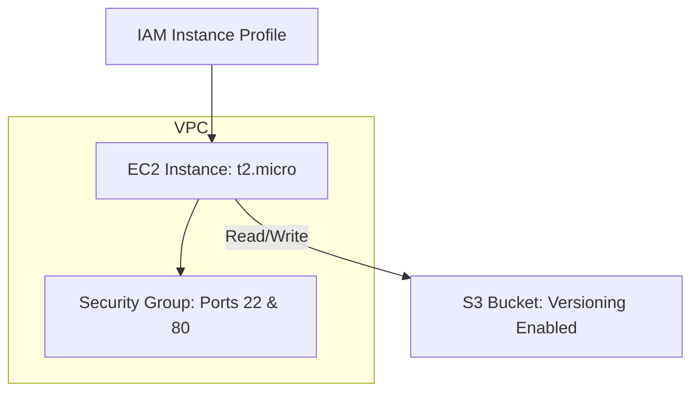

# TerraForge — AWS Infrastructure Automation

TerraForge is a clean, secure, and Free-Tier compliant infrastructure-as-code (IaC) project designed to automate the provisioning of core AWS resources: an EC2 web server, a secure S3 storage bucket, and least-privilege IAM credentials linking the two.

---

## Architecture Overview



1. **VPC & Security Group**: The EC2 instance deploys in the default VPC. The security group permits SSH (port 22) and HTTP (port 80) access from the public internet (`0.0.0.0/0`), and blocks all other ports.
2. **EC2 Web Server**: A single `t2.micro` running Amazon Linux 2023. A bootstrap `user_data` script updates packages, installs and enables Nginx, and overwrites the default home page to show a custom deployment message.
3. **S3 Storage**: A private, version-controlled S3 bucket. All public access (ACLs and Policies) is explicitly blocked to enforce security best practices.
4. **Least-Privilege IAM**: An IAM role is assumed by the EC2 instance (using an Instance Profile) that grants it access to list, read, write, and delete files *only* in this specific S3 bucket.

---

## File Directory

*   [main.tf](main.tf): Sets up Terraform versioning and initializes the AWS provider.
*   [variables.tf](variables.tf): Parameterizes all infrastructure components (region, instance type, bucket base name).
*   [ec2.tf](ec2.tf): Finds the latest AMI, defines the firewall, and creates the VM + Nginx bootstrap.
*   [s3.tf](s3.tf): Provisions the secure, versioned, and unique bucket.
*   [iam.tf](iam.tf): Creates the fine-grained IAM Role, Instance Profile, and S3 Access Policy.
*   [outputs.tf](outputs.tf): Returns connection strings, IP addresses, and resource ARNs.
*   [terraform.tfvars.example](terraform.tfvars.example): Customization template.

---

## Prerequisites

1.  **AWS Account**: An active account.
2.  **AWS CLI Installed & Configured**: With programmatic access permissions configured locally.
3.  **Terraform CLI Installed**: Version `>= 1.0.0`.

---

## Deployment Steps

1.  **Clone / Go to Project**:
    ```bash
    cd terraforge/terraforge
    ```
2.  **Initialize Terraform**:
    Downloads providers and prepares the working directory.
    ```bash
    terraform init
    ```
3.  **Validate Configuration**:
    Performs formatting and syntax validation checks.
    ```bash
    terraform fmt
    terraform validate
    ```
4.  **Perform Dry Run (Plan)**:
    Shows resources to be created, modified, or destroyed.
    ```bash
    terraform plan
    ```
5.  **Provision Resources (Apply)**:
    Deploys the infrastructure to your AWS account.
    ```bash
    terraform apply
    ```

---

## Deployed / Live Resources

- **AWS Region**: `ap-south-1`
- **EC2 Instance Public IP**: `3.7.194.43` (Elastic IP, Static)
- **React Web App URL**: [http://3.7.194.43](http://3.7.194.43)
- **Grafana Monitoring URL**: [http://3.7.194.43:3000](http://3.7.194.43:3000) (User: `admin` | Password: `TerraForgeSecure2026!`)
- **S3 Bucket Name**: `terraforge-bucket-34ec6698f98a`
- **S3 Bucket ARN**: `arn:aws:s3:::terraforge-bucket-34ec6698f98a`
- **IAM Role ARN**: `arn:aws:iam::381492135195:role/TerraForge-ec2-s3-role`
- **CI/CD Pipeline Runs**: [GitHub Actions Workflow](https://github.com/Ani12234/terraforge/actions)
- **Deployment Date**: `2026-07-15`

> [!NOTE]
> An Elastic IP (EIP) has been allocated and associated with the EC2 instance, so this public IP address is static and will not change when the instance is stopped or restarted.

---

## Clean Up (Teardown)

To remove all provisioned resources and avoid ongoing AWS costs:
```bash
terraform destroy
```
*(All resources built by this configuration, including the S3 bucket and IAM profiles, will be deleted securely. Other resources in your AWS account are completely unaffected).*